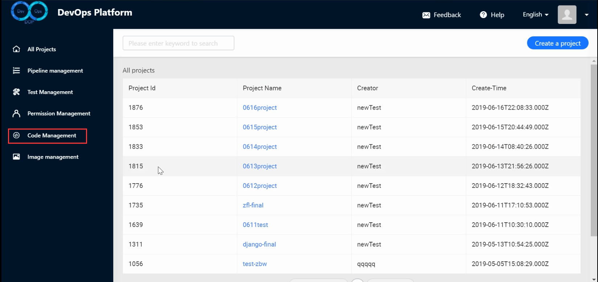

# 1. Instruction

> This chapter introduces the basic functions and usage of DOP. Before using it, you need to do some preparation work, such as creating an account and obtaining permissions

1. Visit：[http://www.dop.clsaa.com](http://www.dop.clsaa.com/)Sign up for a DOP account
2. After receiving the email of registration, click the link to activate the account, find the person in charge of DOP and add access to various functions of DOP
3. Deploy your project using DOP as described in 1.1 or 1.2

## 1.1. Routine use

### 1.1.1. Preparatory phase

#### Prepare the code repository 

> All code pulling in DOP systems is done using Git, so project code must be stored in Git repositories.
>

> You can choose to use DOP's own code management module (code repository) or third-party code repository (such as GitHub, GitLab, etc.).It should be noted that the third-party code repository is used, and the visibility of the repository must be set to be publicly visible (currently the DOP platform is not connected to GitHub and GitLab account system);You can use a private repository if you use DOP's own code repository.
>
> The code management module provided by DOP includes most of the functions of GitLab, and can basically complete daily code management work in the code management module of DOP.

1. Log in DOP and select **code management**
2. The first time you use DOP code management, it is better to add your computer's SSH public key to facilitate the subsequent development of PUSH code

3. Create code repository

4. To view the repository, you can click on the repository name on the repository list page to view the repository.In the repository preview screen, you can see the repository name, icon, visibility, Git repository location, README file, and you can also download or set the repository.

5. To set up the project, click Settings to enter the project Settings page.In the Settings page, you can edit the basic information of the project (name, description, default branch, visible level and delete the project);You can set up the protection branch of the project (to prevent people with low permissions from modifying the content of important branches at will);You can set project members (add other users to the project and set the appropriate roles)

6. Browse files, select **Files** to enter the file browsing interface.You can view the file directory, file contents, the latest commit information and time of a file;You can click on a file name to view the contents of the file, or click on a commit information to view the commit changes.

7. Click commits to enter the project submission record page.You can view the commit record list (commit message, time, sha);You can search for a commit;You can view commit by branch;You can view the file information for a commit;Click on a commit to see the changes to all the commit files.
8. Click the branches to enter the branch page.Can view all branch information of the current project;Can create, delete, and search branches;You can see the latest commit for a branch.

9. Click the tags to enter the tag page.You can view, search, delete, and create labels.You can see the commit corresponding to the label.

10. Click merge request to enter merge request processing page.You can see the list of merges that need to be processed (name, time, operator);A merge request can be created;Click the merge name to view the details of the merge request;Can handle (open, close, merge) merge requests.

#### Prepare the container image repository

> All deployment of DOP is completed with Docker+Kubernetes, so before deployment, the application Docker image needs to be stored, and after the Kubernetes cluster receives the deployment instruction, it will pull and run the image from the image repository.
>
> Your application can use the image management module (image repository) that comes with DOP, or you can use the third-party image repository (DockerHub, ali cloud container image service, etc.), but the access right of the third-party image repository must be set to be public.
>
> Here to explain image management module of the two concepts: namespace (usually on behalf of a project, is a classification of image repository), image repository (generally on behalf of an application, each application image every building general into the same image but with different version number of the repository), image (generally represent a certain version of an application)
>
> docker pull registry.dop.clsaa.com/dop/application-server:2019032515435beb579 为例
>
> registry.dop.clsaa.com is the image repository domain name，
>
> dop is namespace,representing project
>
> application-server is image's name，representing application management service
>
> 2019032515435beb579 is image tag,representing a version of the docker image once

1. Click image management to enter the image management page.You can create, retrieve, browse, and delete namespaces.Visibility of namespaces can be set (user roles must be the Namespace Manager of this Namespace, if they have permissions).

2. To enter the namespace, click the namespace name to enter the namespace page.You can browse, retrieve, and delete the mirror repository in the namespace.You can set namespace members and roles;You can view the operation log for namespaces.

3. To view the image repository, click the name of the image repository in the namespace to enter the mirror repository page.Browse and retrieve the list of different versions of a mirror (mirror name, Docker version, size, abstract, can be directly assigned to pull command);You can delete the repository.It is important to note that the image repository cannot be created directly, and when you create a namespace and push an image directly into it, it is automatically created in that namespace

### 1.1.2. Usage phase

#### project management

> After the above code repository, image repository preparation, you need to create a project (a project can contain many applications, and an application usually corresponds to a service) where you can manage project members and applications.
>
> Of course, you need to have access to DOP before creating the project. Please contact the responsible person for access.

1. To view all projects, click all projects to enter the list of projects page.You can browse, retrieve, and create project.

2. View and set the project. Click the project name to enter the project details page.You can view project information, manage members (add and remove members), and manage applications (browse, retrieve, create and delete applications).

#### application management

> After creating the project, you need to create an application in the project, which often represents a Java service, a NodeWeb, and so on 

1. To view the list of applications, click the application TAB in project details.View all application information in the project;You can create applications;You can retrieve applications.

2. To create an application, click the create application button.Fill in the application name and development mode;Fill in Git repository address (you can fill in the third-party Git address or fill in the DOP internal Git repository address);Fill in the image repository address (you can fill in the third party image repository address or the DOP internal image repository address);For the above two addresses, if you use the modules that come with DOP, you can search the repositories you have just created by searching directly.

3. To view the application, click the application name in the project.Can view and edit application basic information (application ownership, basic information, URL information, etc.);Browse, create, and delete application environments.You can browse, create, and delete application variables.

#### Application environment management

1. View the list of application environments (generally divided into development, test, integration and production), and click environment configuration when entering the application details page.By default, DOP creates a daily development environment for each application.You can create a new environment (currently only available for Kubernetes cluster deployment);You can click configure deployment for a specific environment configuration;You can click on deployment history to see the deployment history of an application in an environment.
2. Environment configuration, click configure deployment to configure an environment in detail.

#### Configure the Kubernetes cluster

1. To authenticate the Kubernetes cluster, first fill in the authentication information of the Kubernetes cluster (URL https://masterIP:6443 and Token) and click submit to allow DOP to manipulate the Kubernetes cluster
2. Select the release strategy, which currently supports only rolling upgrades
3. Select the Yaml file source
   1. Use configuration: DOP will configure you to automatically generate Yaml files based on your options
   2. Use the relative path: fill in a relative path, and DOP will get the Yaml file from the relative path of your project
4. When you choose to use configuration, select the namespace, and select existing or created services
   1. Choose to use the original service (without creating a new service): this way you can search for and use the original service.
   2. Select create new Service: this will create a new Service according to the configuration
5. When you choose to create a new service, you can select how the service is exposed to the outer network.
   1. Ingress: Access the service as a domain name. Once configured, go to the public cloud and set up DNS resolution to the Master node of the Kubernetes cluster. TargetPort is the port exposed by the container (your service)
   2. NodePort: Access the service in MasterIP+Port, and after configuration, access the service directly through MasterIP:Port. TargetPort is the Port exposed by the container (your service).
6. Set the number of replicas (how many instances this service runs)
#### Pipeline creation

1. Click pipeline management to enter the pipeline list page and browse all the pipelines.

2. Click "create pipeline" to create a pipeline, set the basic information of assembly line and trigger mode, and finally set the contents of each stage of assembly line as follows:

   1. Pull code: select the appropriate application /Git repository address
   2. Build: choose a Python project, Maven project, or Node project based on your project type
   3. Build Docker image: choose to build Docker image, select environment, image address and other information
   4. Push Docker image: select push Docker image, select environment, image address and other information
   5. Deploy: select deploy and do not do any other configuration

   

### 4.1.3. run phase

#### Running pipeline

1. Click pipeline management to view pipeline list
2. Click to view a pipeline. If the pipeline has been executed, you can see the visual execution result of pipeline stage
3. Click run pipeline, and the pipeline starts running

#### View the runtime log

1. Click the pipeline to run, the page will be updated in real time
2. You can click the pipeline stage in the page to see the log of a stage execution
	3. If the pipeline stage is successfully executed, the stage is shown in green
	4. If the pipeline stage fails, the stage is shown in red 

### 4.1.4.verification stage

#### View deployment history

1. After successful pipeline execution, you can view the application's deployment history (run id, commitId, mirror version number, snapshot of the environment, deployer, run status). There are three main pieces of information in the deployment history
	1. Click run id to view the pipeline running log
	2. Click commitId to see the corresponding code change for this pipeline run
	3. Click on the image version number to view the deployed docker image
	4. Mouse over the deployment environment to view a snapshot of the kubernetes environment for this deployment

#### View application information

1. Check the status of containers running in Kubernetes' Dashboard
2. test.dop.clsaa.com has been deployed successfully
